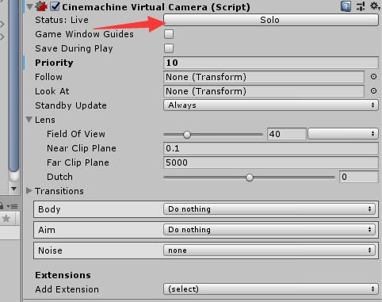

## Cinemachine

### 学习网址

[Unity--Cinemachine官方实例详解](https://blog.csdn.net/qq826364410/article/details/80531508) 

[利用Cinemachine快速创建游戏中的相机系统](https://blog.csdn.net/wzpddh/article/details/80653476) 

[官方教程](https://unity3d.com/learn/tutorials/s/animation)

 

### Cinemachine Brain
挂在Brain必须有Camera
控制中心，会根据当前Live Virtual Camera来将画面渲染至当前渲染相机上。

 

### 虚拟相机主要由六个模块组成
+ **Lens**
包括调整FOV等参数；

+ **Body**
需要设置Follow对象
负责处理相机和跟踪目标之间的相对位置的这样一个关系；
    + Framing Transposer 每帧锁定
    + Hard Lock To Target 强锁定
    + Orbital Transposer 圆圈轨道
    + Tracked Dolly 轨道锁定，Target移动 相机会在轨道做特定运动
    + Transposer 参数非常灵活的设定

+ **Aim**
需要设置LookAt对象
负责处理焦点和跟踪目标在镜头中的相对位置；
    + Composer 灵活设置对焦动画参数
    + Group Composer 对焦一组对象
    + Hard Look At 强锁定 会有一些对焦动画
    + POV
    + Same As Follow Target 跟Target的朝向一致

+ **Noise**
模拟手持相机的晃动；

+ **后处理模块**
让每个镜头有不同的后处理效果；

+ **Extnesions**
可扩展模块：包括碰撞处理等功能。

 

**利用timeline 平滑过渡相机切换**

### 组件类型

+ **Cinemachine ClearShot：** 
必须有children virtual camera
镜头之间的切换，[淡入、淡出、cut]，添加children相机，添加碰撞，设置权重，设置optimal target distance
**ClearShot Camera可以管理一组子虚拟相机。如果子相机具有CinemachineCollider扩展，他们将进行分析目标障碍场景，最佳目标距离等项目，并对其进行评估将镜头质量返回给ClearShot，然后他会选择最好的一个。如果多个子相机具有相同的镜头质量，则具有最高优先级的相机将是选择。**

[CinemachineClearShot 视频](https://www.bilibili.com/video/av19187089)

+ **Cinemachine Blendlist Camera:** 
必须有children virtual camera
多个相机之间做切换，淡入淡出

+ **Cinemachine External Camera:**
衔接外部unity自身Camera，暂时没发现什么特别的用处

+ **Cinemachine Freelook**  
设置follow target，设置Top、Mid、Bottom的视角点，根据follow Target的位置和Top、Mid、Bottom的视角点的位置，对相机进行差值动画，相机的视角变动都是围绕Mid点进行

+ **Cinemachine Mixing Camera** 
必须有children virtual camera
两个相机画面混合，暂时没法发现使用的特殊效果。

+ **Cinemachine State Driven Camera**
必须有children virtual camera
根据动画状态，根据动画状态激活设置的virtualcamera

+ **Cinemachine VirtualCamera** 
最常用基础组件

+ **DollyTrack:**
相机轨道
重要组件->Cimemachine Smooth Path：设置轨道点，可以首尾相连
virtualCamera:设置bady为Tracked Dolly，绑定Path，打开AutoDolly，**不打开AutoDolly相机不会自动在轨道滑动**
**效果：移动目标物体，相机就会根据物体的位置，在轨道做滑动。**
[使用unity Cinemachine做出相机沿固定轨道移动且镜头自动聚焦对象效果](https://blog.csdn.net/ILYPL/article/details/78083159?locationNum=8&fps=1) 

+ **DollyCart**
重要组件->CinemachineDollyCart、CinemachineSmoothPath
CinemachineDollyCart的path绑定CinemachineSmoothPath
需要运动的物体(如相机，npc等)放到CinemachineDollyCart下面，就会根据路径运动，注意设置速度。

 

### 特别脚本
+ **Cimemachine Smooth Path**
相机轨道要挂该脚本。
Resolution：该值越大，滑动就越平滑，当然计算量就越大。

 

******  

## Question

**cinemachine和timeline**：镜头一定要拉到最后一帧，否则在出clip的时候，cinemachineBrain会根据权重重新设置LiveCamera。

 

### 渲染当前选中相机

 