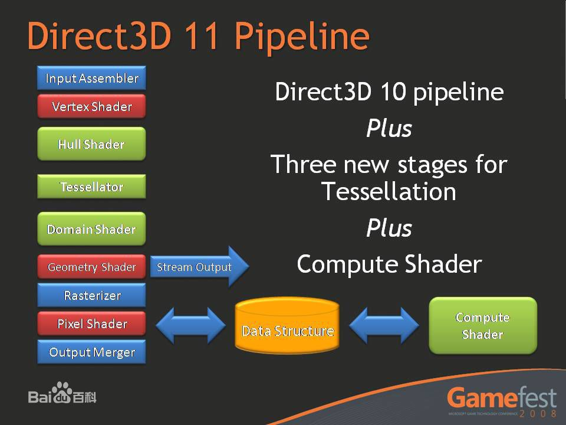
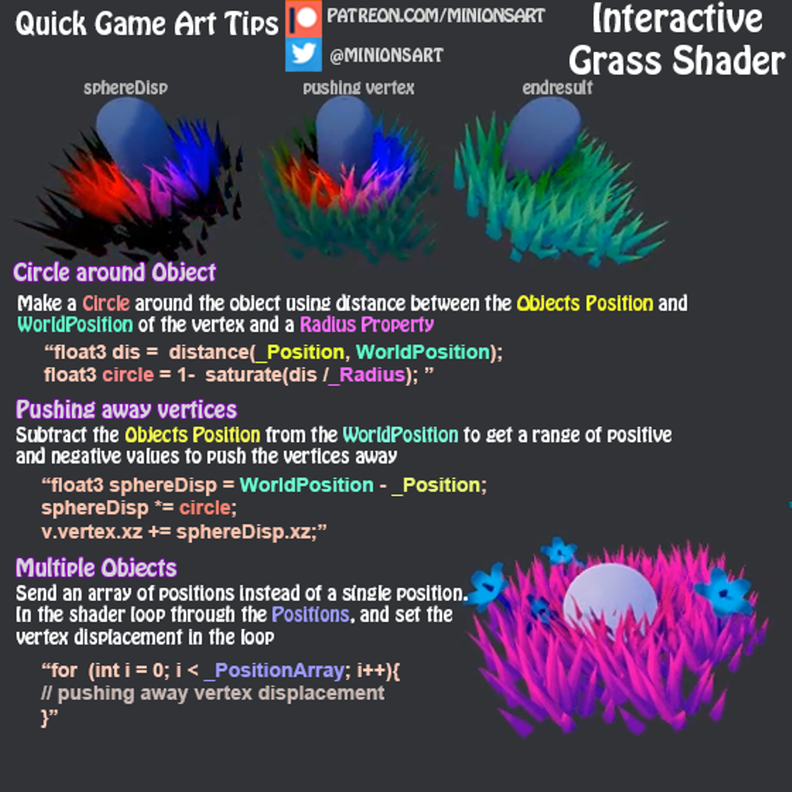

# 图形

## Unity Shader

### 编译命令说明

+ **\#pragma vertex name**
将函数name的代码编译成顶点程序

+ **\#pragma fragment name**
将函数name的代码编译成片段程序

+ **\#pragma geometry name**
将函数name的代码编译成DX10的几何着色器

+ **\#pragma hull name**
将函数name的代码编译成DX11的hull着色器

+ **\#pragma domain name**
将函数name的代码编译成DX11的domain着色器

+ **\#pragma fragmentoption option**
添加选项到编译的OpenGL片段程序，对于顶点程序或编译目标不是OpenGL的无效

+ **\#pragma target name**
设置着色器的编译目标

+ **\#pragma only_renderers space separated names**
仅编译到指定的渲染平台

+ **\#pragma exclude_renderers space separated names**
不编译到指定的渲染平台

+ **\#pragma glsl**
为桌面系统的OpenGL进行编译时，将Cg/HLSL代码转换成GLSL代码

+ **\#pragma glsl_no_auto_normalization**
编译到移动平台GLSL时，关闭顶点着色器中对法线和切线进行自动规范化

 

### 曲面细分(Tessellation)

使用了Vertex Hull Domain Fragment Shader， 注意这里的Vertex函数是针对细分前的顶点，**Hull函数负责进行顶点的插值细分**，而**Domain Shader则相当于每个细分后的顶点的Vertex函数**，最后的**Fragment函数和普通Shader中的Fragment函数无异**。
执行顺序大致如下：
1. 每个模型顶点执行一次Vertex函数
2. Vertex函数将返回值传入Hull函数
3. Hull函数与其分支函数负责将传入的一个面片通过添加节点切分为数块
4. 细分后每个顶点（包括原顶点）都会执行一次Domain函数，相当于我们平时写的Vertex函数。

[Unity Tessellation](https://docs.unity3d.com/Manual/SL-SurfaceShaderTessellation.html)

主要的几种方式：
1. **No GPU tessellation, displacement in the vertex modifier**
This next example shows a surface shader that does some displacement mapping without using tessellation. It just moves vertices along their normals based on the amount coming from a displacement map
根据dispmap采样后，沿着法线方向做偏移

2. **Fixed amount of tessellation**
If your model’s faces are roughly the same size on screen, add a fixed amount of tesselation to the Mesh
 the tessFixed tessellation function returns four tessellation factors as a single float4 value: three factors for each edge of the triangle, and one factor for the inside of the triangle.

3. **Distance-based tessellation 基于距离**
You can also change tessellation level based on distance from the camera
. For example, you could define two distance values:
The distance when tessellation is at maximum (for example, 10 meters).
The distance when the tessellation level gradually decreases (for example, 20 meters).

4. **Edge length based tessellation 基于边长**
Purely distance based tessellation is effective only when triangle sizes are quite similar. In the image above, the GameObjects that have small triangles are tessellated too much, while GameObjects that have large triangles aren’t tessellated enough.
One way to improve this is to compute tessellation levels based on triangle edge length on the screen. Unity should apply a larger tessellation factor to longer edges.

5. **Phong Tessellation 基于视角**
Phong Tessellation modifies positions of the subdivided faces so that the resulting surface follows the mesh normals a bit. It’s quite an effective way of making low-poly meshes become more smooth.
Unity’s surface shaders can compute Phong tessellation automatically using tessphong:VariableName compilation directive. 

 

******

## CommandBuffer

[CommandBuffer的基本用法](https://blog.csdn.net/puppet_master/article/details/72669977)
[Command Buffers In Unity](https://cloud.tencent.com/developer/news/102132)
******

## Cases

### Projector 投影器（释放技能贴花、脚印贴花的实现）

[Unity Projector 投影器原理以及优化](http://www.dreamfairy.cn/blog/2018/11/19/unity-projector-opmize/)

Cube当做投射矩阵，计算投影矩阵，shader中再次计算想要的投射空间下的坐标，重新采样即可。

 

### 雪地脚印交互

重点：RenderTexture、高度图、曲面细分
脚印小时，timer修改RenderTexture

[Unity下带法向的Bump Mapping(雪地效果)](https://www.jianshu.com/p/f67bf24eb152)
[Unity中如何实现可互动的松软雪地一样的效果？](https://www.zhihu.com/question/68363518)
[Github  ZGeng/DeepSnowFootprint](https://github.com/ZGeng/DeepSnowFootprint)
[chenjd/Unity-Miscellaneous-Shaders](https://github.com/chenjd/Unity-Miscellaneous-Shaders/blob/master/README.md)

 

###交互草地

[交互草地](https://www.patreon.com/posts/quick-game-art-19844414?tdsourcetag=s_pctim_aiomsg)

 

### 使用深度图重建世界坐标

[使用深度图重建世界坐标](https://blog.csdn.net/wodownload2/article/details/85054488)

[Unity Shader-深度相关知识总结与效果实现 LinearDepth，Reverse Z，世界坐标重建，软粒子，高度雾，运动模糊，扫描线效果](https://blog.csdn.net/puppet_master/article/details/77489948)

[How to go from device coordinates back to worldspace in OpenGL (with explanation)](http://feepingcreature.github.io/math.html)

 

******

## Question

### 为什么透视计算的深度是非线性深度

[为什么透视计算的深度是非线性深度](https://www.cnblogs.com/pbblog/p/3484193.html?tdsourcetag=s_pctim_aiomsg) 

 

******