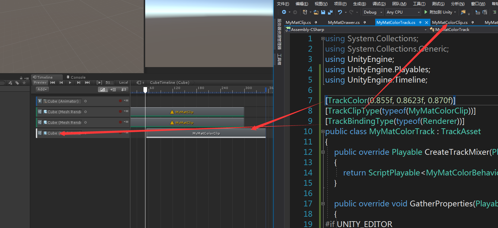

## timeline 学习网址 

[Timeline扩展功能实践指南](https://mp.weixin.qq.com/s?__biz=MzU5MjQ1NTEwOA==&mid=2247494864&idx=1&sn=b3c96173375cc230c65caf2665aa195f&chksm=fe1dd87bc96a516ddee5f7b66425dea7fcd9f0037ccecefc146e36b4fb58ebea3cb966656066&mpshare=1&scene=23&srcid=0911huGCkprZi0lANcVySqJK#rd) 

[为Timeline创造性地设计脚本](https://mp.weixin.qq.com/s?__biz=MzU5MjQ1NTEwOA==&mid=2247492365&idx=1&sn=770fbb0b73ed28dab4a52de1240892f6&chksm=fe1dd7a6c96a5eb029913ddbc9a64aef1e2806a4e317355c62b4b24a6508f912a3d02eb86723&scene=21#wechat_redirect)

[Unity 2017 | Timeline功能亮点Playable API](https://mp.weixin.qq.com/s?__biz=MzU5MjQ1NTEwOA==&mid=2247490408&idx=1&sn=df3b8ed1831390bb7906af8e43621402&chksm=fe1e2fc3c969a6d5d5c63f7be16c85a717a362dd23ab154373d676c6937ff4e0864ea93d56ee&scene=21#wechat_redirect)

[揭秘ADAM | Timeline的运用](https://mp.weixin.qq.com/s?__biz=MzU5MjQ1NTEwOA==&mid=2247490277&idx=1&sn=25b0175be4718323ddbf24bc09762522&chksm=fe1e2e4ec969a758050da74032b9c9ed1006fe3c2e9e6e48599c36e8812bd78e862d40d1d486&scene=21#wechat_redirect)

[Unity高手在民间：Timeline与Cinemachine社区作品赏析](https://mp.weixin.qq.com/s?__biz=MzU5MjQ1NTEwOA==&mid=2247490385&idx=1&sn=7a96ef022f9bc45f8fce4ab6f893ad89&chksm=fe1e2ffac969a6ec3fe3beabe4d16231472cfbbbbe649e637457a38487a090fd510d1c242089&scene=21#wechat_redirect)

**内网资源：**\\172.18.0.1\Department\ProjectS\UnityStore\Asset Store-5.x\Timeline 

******  

## timeline知识点 

Timeline和Cinemachine


目前Timeline包括以下六个基本轨道类型：

+ Animation
用于播放AnimationClip或者关键帧动画。

+ Activation
用于控制物体的激活状态。

+ Audio
用于音效的播放。

+ Control
用于控制粒子，或者另一个Timeline对象的播放。

+ Playable
用于自定义的播放行为。

+ Cinemachine
用于控制Cinemachien相机系统的播放。   

+ 自定义 


**有k动画功能**

**Camera--CM vcam 剧情分镜头**

******  

## PropertyDrawer

[[Unity]用PropertyDrawer自定义struct/class的外观](https://www.cnblogs.com/yangrouchuan/p/6698844.html)

****** 

## 自定义timelineclip

[深入浅出Timeline之Timline的编辑器扩展](https://blog.csdn.net/q568360447/article/details/80356316?utm_source=blogxgwz3)

制作自定义的timelineclip需要定义3个类，它们分别继承自：PlayableTrack，PlayableAsset，PlayableBehaviour

****** 

## 问题记录 

**模板行为不能嵌套使用**：即一个Behaviour包含另外一个Behaviour，因为即使包含了另外的Behaviour，他的行为也不会被执行。


 
**TrackColor**：轨道的颜色 
**TrackClipType**：轨道关联的片段脚本
**TrackBindingType**：轨道绑定的对象类型（可以是gameobject、Texture等）


******  

## timeline 工作需求 

1. 动态绑定
playableDirector.SetGenericBinding(Object key, Object value) 可以动态设置
个人封装 用字典<string,binding>来记录轨道信息
2. Editor绑定
3. 接口生命周期 

**动态修改track的binding**
pc可行
android移动端可行


**动态修改clip的参数**
pc可行
android移动端可行

**ExposedReference的传值**
```
    clip.template._startLocation = default(ExposedReference<Transform>);
    clip.template._startLocation = new ExposedReference<Transform>();
    clip.template._startLocation.defaultValue = cube.transform;
```

<br/>

**ExposedReference的坑**

**ExposedReference动态赋值的时候，一定要new一个新的ExposedReference，然后再赋值，否则可能赋值不成功**，如下
```
    clipUp.startLocation = new ExposedReference<Transform>();
    clipUp.startLocation.defaultValue = _startPoint;
```

<br/>

**各个脚本功能框架**
+ Track
    1. 轨道颜色
    2. 绑定clip，**[TrackClipType(typeof(类型))]**
    3. 绑定Object，**[TrackBindingType(typeof(类型))]**
    4. 重载CreateTrackMixer，用于桥接**MixerBehaviour**
+ Clip
    1. 定义模板 template
    2. 设置ClipCaps类型
    3. 重载CreatePlayable，用于桥接**Behaviour**
    + **为了规范起见，这里不在定义ExposedReference，ExposedReference的定义将移动到Behaviour中**
+ Behaviour
    1. 定义数据，**隐藏的数据加[HideInInspector]**
    2. 定义ExposedReference
    3. 重载OnGraphStart，在这里初始化数据
    4. 重载OnPlayableCreate，**初始化ExposedReference对象（playable.GetGraph()PlayableGraph**
+ MixerBehaviour：
    1. 重载ProcessFrame，用于执行帧逻辑操作 
    2. 用户可Blend的Clip混合操作，通过GetWeight获取当前Clip的权重
    3. 如果没有Blend 可以不在这里做操作
+ Drawer
    1. Editor脚本，定义clip脚本在Inpsect面板的显示

<br/>

**PlayableBehaviour生命周期**
OnPlayableCreate->OnGraphStart->OnBehaviourPause->OnBehaviourPlay->OnBehaviourPause->OnGraphStop->OnPlayableDestroy
**注意**：启动和停止都会调用一次OnBehaviourPause
    
**OnPlayableCreate**：clip里面的CreatePlayable执行后就会执行此方法。playabledirector执行play时执行此方法
**OnBehaviourPlay**：进入相关clip片段时执行此方法
**OnBehaviourPause**：退出相关clip片段时执行此方法
**OnGraphStop**：playabledirector执行stop执行此方法。失去焦点也会执行此方法，播放彻底完成会执行此方法
**OnPlayableDestroy**：playabledirector执行stop执行此方法。失去焦点也会执行此方法,播放彻底完成会执行此方法
>>
+ **问题**
    1. 播放完成时，有时候会执行OnGraphStop，OnPlayableDestroy 有时候却不会？
    答案：因为用的Wrap Mode 用的Hold模式，会在最后一帧阻塞住，所以不会执行销毁流程。将Wrap Mode设置为None即可。

<br/>

**特殊用法**
1. Playable Track：不绑定Object只有Clip和Behavior脚本

**PlayableDirector Wrap Mode**
+ None 走完流程会自动重置为初始状态，完整的生命周期。
+ Hold 走完整个流程后，会在最后阻塞，不会自动调用OnGraphStop和OnPlayableDestroy，除非主动stop整个timeline
+ Loop 循环执行整个流程，期间不会调用OnGraphStop和OnPlayableDestroy，除非主动stop整个timeline
    >>
**sommarize**：一般情况使用None；Hold和Loop都需要主动stop才会执行OnGraphStop和OnPlayableDestroy； 

****** 

## 问题记录 

**cinemachine和timeline**：镜头一定要拉到最后一帧，否则在出clip的时候，cinemachineBrain会根据权重重新设置LiveCamera。

+ **OnGraphStart和OnPlayableCreate**中获取duration，获取的数据是错误的，**OnBehaviourPlay**中获取的是正确信息。获取代码$playable.GetDuration()$ ,unity版本2018.2
****** 

## Question

### Q： Editor 中用脚本修改Clip的Duration和DisplayName
A：用反射方式修改参数
```
    SerializedObject editorGUI = new SerializedObject(Selection.activeObject);

    //duration
    SerializedProperty duration = editorGUI.FindProperty("m_Clip.m_Duration");
    duration.doubleValue = clip.length;

    //display name
    SerializedProperty name = editorGUI.FindProperty("m_Clip.m_DisplayName");
    name.stringValue = aniName.stringValue;

    editorGUI.ApplyModifiedProperties();
```

<br/>

### Q：PlayableBehaviour 时间接口
A:
**SetTime():** Changes the current local time of the Playable.
**GetTime():** Returns the current local time of the Playable.
**GetPreviousTime():** Returns the previous local time of the Playable.

GetTime() 的值要**大于** GetPreviousTime()

都是从进入Clip进入的第一帧开始统计

<br/>

******