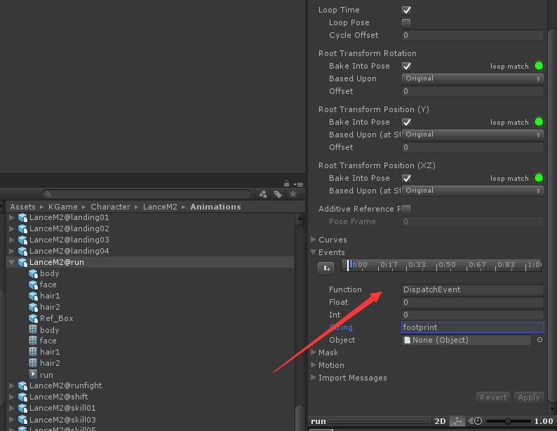
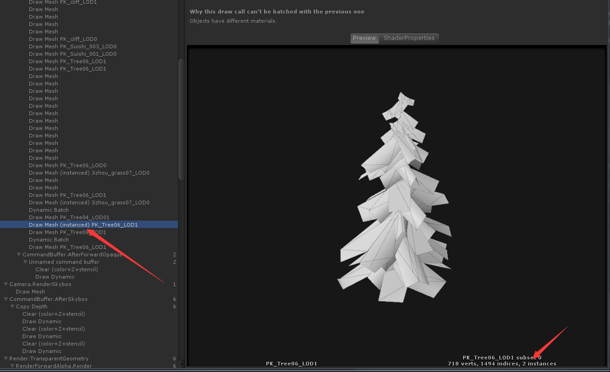
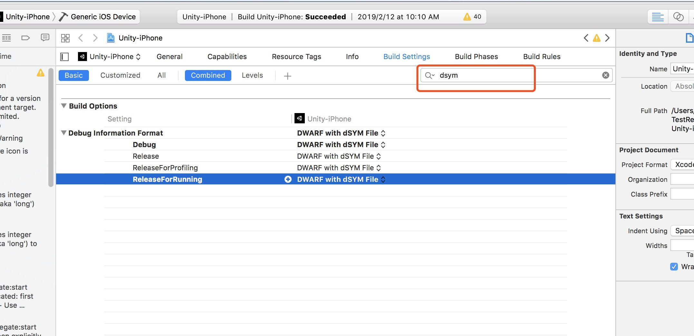
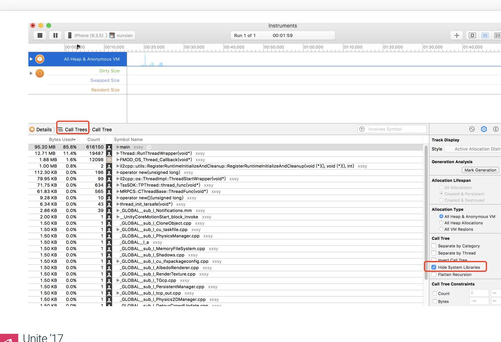
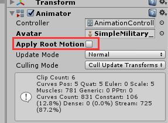

## Unity


### Awake、OnEnable、Start

**Awake**在实例化GameObject的时候调用，紧接着调用**OnEnable**，并在下一帧调用**Start**

例如
```
    GameObject go = UnityEngine.Object.Instantiate(prefab) as GameObject;
    Debug.Log("这里会调用Awake 和 OnEnable");
    yield return 0;
    Debug.Log("这里会调用Start");
```

**注意：** 即使 ***脚本的Active=false，Awake也会执行***。当 ***GameObject的Active=false时，Awake不会被执行***。

<br/>

### Animator暂停

```
  animator.speed = 0;//暂停
  animator.speed = 1;//恢复
  animator.speed = 2;//加速播放
```

<br/>

### AnimationEvents



脚本中进行如下定义即可：
```
    void DispatchEvent(string msg)
    {
        Debug.LogError(">>>>>Animation>>>>>>" + msg);
    }
```

**注意：** 脚本必须挂在含有Animator组件的Object上面，而且Animator的AnimatorController必须有值，否则触发不了Event。


<br/>

### CPU Skinning

CPU Skinning 是在PostLateUpdate之后执行的，PostLateUpdate是在LateUpdate之后执行

<br/>

### Cube渲染出来为什么6个面都是一样的
因为uv设置的关系，每个面的uv左下角都是（0,0）右上角uv都是（1,1）

<br/>

****** 


## 性能优化

### UMA

[UMA:Unity性能优化大集合](https://blog.uwa4d.com/archives/allinone.html)

<br/>

### 协程

+ 减少协程的使用，每开启一个协程都会产生gc

<br/>

+ yield return的使用
    ```
    //0 gc
    yield return "22";

    //0 gc
    yield return null;

    //16b gc
    yield return new WaitForEndOfFrame();

    //20b gc
    yield return 1;

    //20b gc
    yield return 2;

    //20b gc
    yield return 0.5f;

    //16b gc
    yield return new WaitForFixedUpdate();

    //20b gc
    yield return new WaitForSeconds(0.5f);

    //20b gc
    yield return new WaitForSecondsRealtime(0.5f);
    ```
    **为什么yield return 1会有gc而yield return null 和 yield return "22"不会有呢？**
    答：因为yield return会触发迭代器的MoveNext,返回的是一个Object类型数据，如果是Int或者Float将会触发装箱拆箱操作，就会产生gc。而字符串和null都是引用类型，不存在装箱拆箱的操作，所以不会有gc产生。

<br>

### material、sharedMaterial、MaterialPropertyBlock

#### material

render.material 将会产生一个临时的**materialInstance**，尽量不要使用，推荐使用**sharedMaterial**
```
    MeshRenderer mr = fz.GetComponent<MeshRenderer>();
    mr.material.SetColor("_Color", Color.red);
```

<br />

#### sharedMaterial

render.sharedMaterial 将不会产生临时材质，但结果就会导致**使用这个材质的Render都会被修改**
```
    MeshRenderer mr = fz.GetComponent<MeshRenderer>();
    mr.sharedMaterial.SetColor("_Color", Color.red);
```

<br />

#### MaterialPropertyBlock

对共享材质使用MaterialPropertyBlock来修改颜色，就会避免直接修改sharedMaterial而导致的全部修改问题，同时也不会产生临时材质

```
        // 这种情况修改材质 将会创建临时材质（材质名称后有Instance）
        // Profit中会看到 临时材质创建的消耗（在Memory的Material选项下有类似：matname(Instance) ）
        myRender.material.SetColor("_TintColor", tempColor);


        // 当然也可以修改共享材质 但是共享材质一修改 所有用到该材质的都会修改
        // 很多应用场景不符合
        myRender.sharedMaterial.SetColor("_TintColor", tempColor);


        //MaterialPropertyBlock 的方式修改 可以完美避开上面两点的缺陷
        MaterialPropertyBlock popb = new MaterialPropertyBlock();
        popb.SetColor("_TintColor", tempColor);
        myRender.SetPropertyBlock(popb);
```

**总结**：不要使用$myRender.material.SetColor$ 这种方式修改材质，替换为$MaterialPropertyBlock$。**使用MaterialPropertyBlock来替换Material属性操作**

**注意：**
+   MaterialPropertyBlock的使用将导致动态合批失败
Dynamic batching works on objects with any low poly mesh using the same material. **Multiple copies of an otherwise identical material, or the use of material property blocks will both break batching.** This is because when something is dynamically batched it's being rendered as if it is a single mesh with a single material.**Property blocks cannot affect only part of a mesh, it's all or nothing.**

+ 使用MaterialPropertyBlock时，**尽量一个Render对应一个MaterialPropertyBlock**，
因为，如果多个Render共同使用一个MaterialPropertyBlock，**将导致他们的属性会被共同修改**，就是修改了其中一个，那么其他的也会被修改；**如果一个Render使用了多个MaterialPropertyBlock，那Render只会认定第一个被设置的MaterialPropertyBlock,后续的MaterialPropertyBlock的将会失效，即使你修改了它，也不会起作用**

<br/>

### 资源加载

[参考链接：加载模块之资源加载](https://blog.uwa4d.com/archives/LoadingPerformance_Texture.html)

Loading.UpdatePreloading，这一项仅在调用类似LoadLevel（Async）的接口处出现，主要负责卸载当前场景的资源，并且加载下一场景中的相关资源和序列化信息等。下一场景中，自身所拥有的GameObject和资源越多，其加载开销越大。

**Loading.ReadObject，这一项记录的则是资源加载时的真正资源读取性能开销**，基本上引擎的主流资源（纹理资源、网格资源、动画片段等等）读取均是通过该项来进行体现。可以说，这一项很大程度上决定了项目场景的切换效率。

**结论：**
1. 纹理资源的分辨率对加载性能影响较大，分辨率越高，其加载越为耗时。设备性能越差，其耗时差别越为明显；

2. 设备越好，加载效率确实越高。但是，对于硬件支持纹理（ETC1/PVRTC）来说,中高端设备的加载效率差别已经很小，比如图中的红米Note2和三星S6设备，差别已经很不明显。

3. 纹理资源的格式对加载性能影响同样较大，Android平台上，ETC1和ETC2的加载效率最高。同样，iOS平台上，PVRTC 4BPP的加载效率最高。

4. RGBA16格式纹理的加载效率同样很高，与RGBA32格式相比，其加载效率与ETC1/PVRTC非常接近，并且设备越好，加载开销差别越不明显；

5. RGBA32格式纹理的加载效率受硬件设备的性能影响较大，ETC/PVRTC/RGBA16受硬件设备的影响较低。

**建议：**
1. 严格控制RGBA32和ARGB32纹理的使用，在保证视觉效果的前提下，尽可能采用“够用就好”的原则，降低纹理资源的分辨率，以及使用硬件支持的纹理格式。

2. 在硬件格式（ETC、PVRTC）无法满足视觉效果时，RGBA16格式是一种较为理想的折中选择，既可以增加视觉效果，又可以保持较低的加载耗时。

3. 严格检查纹理资源的Mipmap功能，特别注意UI纹理的Mipmap是否开启。在UWA测评过的项目中，有不少项目的UI纹理均开启了Mipmap功能，不仅造成了内存占用上的浪费，同时也增加了不小的加载时间。

4. ETC2对于支持OpenGL ES3.0的Android移动设备来说，是一个很好的处理半透明的纹理格式。但是，如果你的游戏需要在大量OpenGL ES2.0的设备上进行运行，那么我们不建议使用ETC2格式纹理。因为不仅会造成大量的内存占用（ETC2转成RGBA32），同时也增加一定的加载时间。下图为测试2中所用的测试纹理在三星S3和S4设备上加载性能表现。可以看出，在OpenGL ES2.0设备上，ETC2格式纹理的加载要明显高于ETC1格式，且略高于RGBA16格式纹理。因此，建议研发团队在项目中谨慎使用ETC2格式纹理。

<br/>

### 网格资源

[参考链接：加载模块之网格资源](https://blog.uwa4d.com/archives/LoadingPerformance_Mesh.html)

网格资源与纹理资源一样，在加载时同样会造成较高的CPU占用，且其加载效率由其自身大小（网格数据量）决定。因此，我们通过选择不同数据量的网格资源来详细分析其加载效率。

**结论：**
1. 资源的数据量对加载性能影响较大，面片数越多，其加载越为耗时。设备性能越差，其耗时差别越为明显；

2. 随着硬件设备性能的提升，其加载效率差异越来越不明显。

3. 顶点属性的增加对内存和AssetBundle包体大小影响较大。与测试1中未引入Tangent顶点属性的网格数据相比，测试2中的网格数据在内存上均大幅度增加（增加量与网格顶点数有关），且AssetBundle大小同样有成倍（1~2）的增加。

4. 顶点属性增加对于加载效率影响较大，且顶点数越多，影响越大。

5. 关闭Read/Write功能会降低AssetBundle的物理大小，其降低量与资源本身数据量相关。同时，关闭Read/Write功能会大幅度降低网格资源的内存占用；

6. 关闭Read/Write功能会略微提升该资源的加载效率。

**建议：**
1. 在保证视觉效果的前提下，尽可能采用“够用就好”的原则，即降低网格资源的顶点数量和面片数量；

2. 研发团队对于顶点属性的使用需谨慎处理。通过以上分析可以看出，顶点属性越多，则内存占用越高，加载时间越长；

3. 如果在项目运行过程中对网格资源数据不进行读写操作（比如Morphing动画等），那么建议将Read/Write功能关闭，既可以提升加载效率，又可以大幅度降低内存占用。

<br/>

### Shader

[参考链接：加载模块之Shader](https://blog.uwa4d.com/archives/LoadingPerformance_Shader.html)

Shader资源与之前的网格资源和纹理资源不同，其本身物理Size很小。**一般来说，一个Shader资源的物理Size仅几KB，在内存中也不过几十KB。所以，Shader资源的效率加载瓶颈并不在其自身大小的加载上，而是在Shader内容的解析上。**

**结论：**

1. Shader资源的物理体积与内存占用虽然很小，但其加载耗时开销的CPU占用很高，这主要是因为Shader的解析CPU开销很高，成为了Shader资源加载的性能瓶颈；

2. Mobile/Particles Additive在解析方面的耗时远小于Mobile/Diffuse、Mobile/Bumped Diffsue甚至Mobile/VertexLit;

3. 除Mobile/Particles Additive外，其他三个主流Shader在加载时均会造成明显的降帧，甚至卡顿。因此，研发团队应尽可能避免在非切换场景时刻进行Shader的加载操作；

4. 随着硬件设备性能的提升，其解析效率差异越来越不明显。

5. Mobile Shader较之同种Normal Shader在加载方面确实有一定的性能提升；

6. 设备性能越低，性能差距越大，比如Mobile/Bumped Diffuse和Bumped Diffuse的加载性能差距在红米2低端机上达到30ms+。

**建议：**
1. 通过依赖关系打包，将项目中的所有Shader抽离并打成一个独立的AssetBundle文件，其他AssetBundle与其建立依赖；

2. Shader的AssetBundle文件在游戏启动后即进行加载并常驻内存，因为一款项目的Shader种类数量一般在50~100不等，且每个均很小，即便全部常驻内存，其内存总占用量也不会超过2MB；

3. 后续Prefab加载和实例化后，Unity引擎会通过AssetBundle之间的依赖关系直接找到对应的Shader资源进行使用，而不会再进行加载和解析操作。

4. 在保证渲染效果和项目需求的情况下，尽可能降低Shader的Keyword数量，以提升Shader的加载效率；

5. 对于简单Shader，可尝试去除Fallback操作，该方法非常适合于目前正在大量使用的Mobile/Diffuse、Mobile/Bumped Diffuse等Built-in Shader；

6. 尽可能对Shader进行单独、依赖关系打包并对其进行预加载，以降低后续不必要的加载开销。

<br/>

+ **Shader.Parse 和 Shader.CreateGpuProgram 到底是做什么的？它们什么时候执行？**
**UMA的回答是**：$Shader.Parse$体现的是Shader的加载和解析， $Shader.CreateGpuProgram$ 是将Shader传入GPU的一次提交，GPU驱动会对其进行编译，以适应于特定的设备或平台。在Unity 5.x版本中，$Shader.Parse$在Shader资源加载时进行执行，而 $Shader.CreateGpuProgram$在所在GameObject第一渲染时进行执行。
**2018.2测试**： 在$assetbundle.loadasset$时同时发生。也就是说$Shader.Parse$和$Shader.CreateGpuProgram$都是在加载资源的时候执行

<br/>

### 使用ShaderVariantCollection和WarmUp接口

使用**ShaderVariantCollection**和**WarmUp接口**可以减少Shader.Parse和 Shader.CreateGpuProgram的调用次数。
使用步骤：
1. 新建ShaderVariantCollection资源，将用到的shader放进该资源中，并设置好要编译进去的Keyword。打包成assetbundle
2. 加载打包的assetbundle，从ab中加载ShaderVariantCollection资源,并调用WarmUp接口。
    ```
    svc = ab.LoadAsset<ShaderVariantCollection>("FXCollection");
    
    //该接口将包含的shader一起发给GPU进行编译
    svc.WarmUp();
    ```
**注意**：加载出来的ShaderVariantCollection一定不能是局部变量，否则系统GC触发或者调用Resources.UnloadUnusedAssets()的方法时就会将已经编译的shader资源全部回收掉，下次加载Object又重新触发Shader.Parse和Shader.CreateGpuProgram。**所以，加载出来的ShaderVariantCollection变量，一定要将它设置为静态变量（static），或者将其放在一个不会销毁的Object中，保持其引用一直存在，就不会再GC的时候被系统回收。**

<br/>

### 动画片段

AnimationClip资源是项目运行时最常加载的资源之一，且其加载效率主要由其自身加载量决定，而决定AnimationClip资源加载量的主要因素则是它的压缩格式。目前，Unity引擎对导入的AnimationClip提供三种压缩格式，Off、Keyframe Reduction和Optimal。其中，Off表示不采用压缩处理；Keyframe Reduction表示使用关键帧进行处理，Optimal则表示Unity引擎会根据动画曲线的特点来自动选择一个最优的压缩方式，可能是关键帧压缩，也可能是Dense压缩。

**结论：**
1. Optimal压缩方式确实可以提升资源的加载效率，无论是在高端机、中端机还是低端机上；
2. 硬件设备性能越好，其加载效率越高。但随着设备的提升，Keyframe Reduction和Optimal的加载效率提升已不十分明显；
3. Optimal压缩方式可能会降低动画的视觉质量，因此，是否最终选择Optimal压缩模式，还需根据最终视觉效果的接受程度来决定。

<br/>

### GPU Instancing

+ **Q: 如何判断有没有被GPU Instancing？**
**Q:如何查看有几个东西被Instancing？**

有 **(instanced)** 标识的证明是被Instance了；图右下角 **2instances** 表明了两个Object被instance了

<br/>

### Unity自带的Attribute的使用

[Unity3D Attributes用法小结](https://blog.csdn.net/qq_24642743/article/details/75092091)

<br/>

******

## Profile

#### Unity Profile
The areas covered by this are:

+ **Unity** The amount of memory tracked by allocations in native Unity code
+ **Mono** The total heap size and used heap size used by managed code. This memory is garbage-collected
+ **GfxDriver** The estimated amount of memory the driver is using on Textures, render targets, Shaders and Mesh data.
+ **FMOD** The Audio driver’s estimated memory usage
+ **Profiler** Memory used for the Profiler data


**Used Total vs Total System Memory Usage**
+ Unity Editor and Players internally use pools for all memory allocations. E.g. when allocating 16 bytes we ask system to allocate 4MB (in the Player) or 16MB (in the Editor) block and then all subsequent allocations use that memory. If block is full, we allocate another one and if it's empty we return it to the system. This technique is used to improve performance and reduce fragmentation.
And also this makes stats a bit confusing.

+ **Used Total** - memory used right now if we don't take pools and allocation headers data into account. Essentially it is sum of all internally managed allocations which are not freed yet. Profiler.GetTotalAllocatedMemoryLong is the Scripting API getter.

+ **Reserved Total** - is how much we took from the system. This includes all allocated memory including pools and extra allocation headers. In our case it is commit memory - we allocate on heap (reserve+commit). Includes Used Total. Scripting API equivalent - Profiler.GetTotalReservedMemoryLong.

+ **Total System Memory Usage** - total size of used (commit) memory by Unity process. This includes everything what is used by the process - Reserved Total + executable's images (code and data). It is PrivateUsage of PROCESS_MEMORY_COUNTERS_EX on Windows.

Taking this into account in your case I would say that if Reserved Total >1GB player might definitely run out of memory on end-goal device. If TSMU>1GB system might page some some memory to disk, but that's not guaranteed and it might make performance horrible. So it is always safer to have TSMU<1GB.
I would say TSMU is what should be mentioned as Required Memory in System Requirements for your game.
(That's assuming you have TSMU data from the player.)

<br/>

#### Android Studio Profile

[Android Memory Management](https://unity3d.com/learn/tutorials/topics/best-practices/android-memory-management)

关于顶部的几种内存类型介绍：
+ **Java:** java代码分配的内存
+ **Native:** c/c++代码分配的内存(有时候其实并没有使用到c/c++代码,但还是会有Native的内存分配，因为Android Framework会去通过java代码访问一些需要使用Native的资源，如图像资源Bitmap)
+ **Graphics:** 图像缓存等，包括GL surfaces, GL textures等.
+ **Stack:** 栈内存（包括java和c/c++）
+ **Code:** 代码的内存分配（例如代码，资源，libs等等）
+ **Other:** 这个是连系统都不知道是什么类型的内存，放在这里.
+ **Allocated:** jave分配的对象个数 (在Android7.1和以下的设备，这个计数是在设备连接后开始，所以并不是app启动时候的计数。Android8.0或更高，在系统里面内置的Profiler工具，所以无论什么时候连接，都是app启动时候的计数)

<br/>

#### Xcode

[一篇文章读懂Unity内存 Understanding Memory on iOS](https://blog.csdn.net/u010019717/article/details/80465361)

<br/>

#### Unity 符号表

+ 在Mac上，符号表的路径是
/Applications/Unity/PlaybackEngines/AndroidPlayer/Variations/mono/Release/Symbols
/Applications/Unity/PlaybackEngines/AndroidPlayer/Variations/il2cpp/Release/Symbols

+ 在windows上，符号表的路径是
C:\Program Files\Unity\Editor\Data\PlaybackEngines\AndroidPlayer\Variations\mono\Release\Symbols\armeabi-v7a\libunity.sym.so
C:\Program Files\Unity\Editor\Data\PlaybackEngines\AndroidPlayer\Variations\il2cpp\Release\Symbols\armeabi-v7a\libunity.sym.so

[Unity符号表](https://www.cnblogs.com/TravelingLight/p/10110318.html)

**Xcode 如何开启符号表**



<br/>

******

## Question

### 技术网址
[unitylist](https://unitylist.com/browse?f=extensions)

### Q:如何创建Cube
A: $GameObject.CreatePrimitive (PrimitiveType.Cube);$ 

<br/>

### UnityEngine.RuntimeInitializeOnLoadMethod

Creation of the runtime class used when Scenes are loaded.
**必须是静态方法**
<br/>

### Camera CullingMask 操作

```
camera.cullingMask = ~(1 << x);  // 渲染除去层x的所有层  
    
camera.cullingMask &= ~(1 << x); // 关闭层x  
    
camera.cullingMask |= (1 << x);  // 打开层x  
  
camera.cullingMask = 1 << x + 1 << y + 1 << z; // 摄像机只显示第x层,y层,z层.  

```
<br/>

### 去掉动画位移



<br/>

### 根据物体计算 其相机的深度值

获取深度值 （测试 感觉计算的深度值不是很对）
```
 a = zFar / ( zFar - zNear )
 b = zFar * zNear / ( zNear - zFar )
 z = distance from the eye to the object
 z_buffer_value =  a + b / z 
```
<br/>

根据深度值，后去距离
```
 z = b / (z_buffer_value-a)
```

<br/>

获取深度值
```
Matrix4x4 _vp = cam.projectionMatrix * cam.worldToCameraMatrix;

Matrix4x4 _vpInverse = _vp.inverse;


//Vector4 _ClipPos = _vp * (new Vector4(target.position.x, target.position.y, target.position.z, 1));

Vector3 _NDCPos = _vp.MultiplyPoint(target.position);
return _NDCPos.z;
```
<br/>

## 大量 Update 为什么效率低

[10000 Update() calls](https://blogs.unity3d.com/2015/12/23/1k-update-calls/)

**为什么？**

1. **Iterate over all Behaviours**
Unity goes over all Behaviours to update them. Special iterator class, SafeIterator, ensures that nothing breaks if someone decides to delete the next item on the list. Just iterating over all registered Behaviours takes 1517ms out of total 9979ms.

<br/>

2. **Check if the call is valid**
Next, Unity does a bunch of checks to **make sure that it is calling a valid existing method on an active GameObject which has been initialized and its Start method called.** You don’t want your game to crash if you destroy a GameObject during Update, do you? These checks take another 2188ms out of total 9979ms.

<br/>

3. **Prepare to invoke the method**
Unity creates an instance of ScriptingInvocationNoArgs (which represents a call from native side to managed side) together with ScriptingArguments and orders IL2CPP virtual machine to invoke the method (scripting_method_invoke function). This step takes 2061ms out of total 9979ms.

<br/>


**解决方法：** 自己封装UpdateManager，将其他GameObject的Update注册到UpdateManager里面去。

<br/>

******