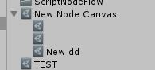
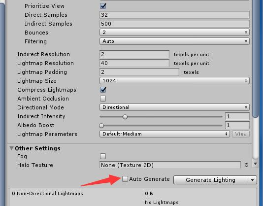
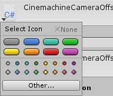

## UnityEditor

### GUI字体大小 颜色
```
    GUIStyle style = new GUIStyle();
    style.fontSize = 100;
    style.normal.textColor = Color.white;
```

<br/>

### GUI Label GUIStyle

```
    GUIStyle tipLabel = new GUIStyle(UnityEditor.EditorStyles.label);
    tipLabel.fixedHeight = 20;
    tipLabel.fontSize = 15;
    tipLabel.alignment = TextAnchor.MiddleLeft;
    tipLabel.normal.textColor = Color.green;
```

<br/>

### 系统自带GUIStyle

```
    //获取所有自带Style
    GUIStyle[] sytles = GUI.skin.customStyles;

    //根据名字获取GUIStyle
    GUIStyle bg = GUI.skin.GetStyle("ObjectPickerPreviewBackground");

    //系统自带的GUIStyle
    //这次获取的是加粗字体的GUIStyle
    GUIStyle boldStyle = EditorStyles.boldLabel;
```

<br/>

### 缩进效果
```
    EditorGUI.indentLevel++;

    //这里写需要缩进的内容
    //EditorGUILayout.PropertyField(m_LensDirt.texture);
    //EditorGUILayout.PropertyField(m_LensDirt.intensity);

    EditorGUI.indentLevel--;
```

<br/>

### GUILayout布局

```
    //水平布局
    private void OnGUI()
    {
        GUILayout.BeginHorizontal("Box"); //开始一个水平布局
        GUILayout.Button("Button");
        GUILayout.Label("Label");
        GUILayout.PasswordField("Password", '$');
        GUILayout.Toggle(true, "");
        GUILayout.EndHorizontal();        //结束一个水平布局

        GUILayout.BeginHorizontal("Box"); //开始一个水平布局
        GUILayout.Button("Button");
        GUILayout.Label("Label");
        GUILayout.PasswordField("Password", '$');
        GUILayout.Toggle(true, "");
        GUILayout.FlexibleSpace();        //创建一个自适应的空白区域，也即是填满本次布局中的这部分空间
        GUILayout.EndHorizontal();        //结束一个水平布局

        GUILayout.BeginHorizontal("Box"); //开始一个水平布局
        GUILayout.FlexibleSpace();        //创建一个自适应的空白区域，也即是填满本次布局中的这部分空间
        GUILayout.Button("Button");
        GUILayout.Label("Label");
        GUILayout.PasswordField("Password", '$');
        GUILayout.Toggle(true, "");
        GUILayout.EndHorizontal();        //结束一个水平布局
    }


    //垂直布局
    private void OnGUI()
    {
        GUILayout.BeginVertical("Box"); //开始一个垂直布局
        GUILayout.Button("Button");
        GUILayout.Label("Label");
        GUILayout.PasswordField("Password", '$');
        GUILayout.Toggle(true, "");
        GUILayout.EndVertical();        //结束一个垂直布局
    }

    //垂直布局
    private void OnGUI()
    {
        GUILayout.BeginVertical("Box"); //开始一个垂直布局
        GUILayout.FlexibleSpace();      //创建一个自适应的空白区域，也即是填满本次布局中的这部分空间
        GUILayout.Button("Button");
        GUILayout.Label("Label");
        GUILayout.PasswordField("Password", '$');
        GUILayout.Toggle(true, "");
        GUILayout.EndVertical();        //结束一个垂直布局
    }


    //滚动布局
    private Vector2 _scroll;
    private void OnGUI()
    {
        _scroll = GUILayout.BeginScrollView(_scroll);//开始一个滚动视野
        GUILayout.BeginVertical("Box");              //开始一个垂直布局
        for (int i = 0; i < 20; i++)
        {
            GUILayout.Button("Button" + (i + 1));
        }
        GUILayout.EndVertical();                     //结束一个垂直布局
        GUILayout.EndScrollView();                   //结束一个滚动视野
    }
```

<br/>

### EditorGUI布局
```

    private void OnGUI()
    {
        EditorGUI.ColorField(new Rect(0, 0, 100, 30), Color.red);
        EditorGUI.DoubleField(new Rect(0, 30, 100, 30), 10);
        EditorGUI.ProgressBar(new Rect(0, 60, 100, 30), 0.5f, "ProgressBar");
    }

    private void OnGUI()
    {
        EditorGUILayout.BeginHorizontal("Box");    //开始一个水平布局
        EditorGUILayout.LabelField("LabelField");
        EditorGUILayout.PasswordField("PasswordField");
        EditorGUILayout.RectField(Rect.zero);
        EditorGUILayout.EndHorizontal();           //结束一个水平布局
    }

```

<br/>

### Editor 右键菜单显示

#### Project窗口下显示右键菜单
```
//在Project窗口下显示右键菜单
[MenuItem("Assets/通道混合工具")]
```

#### Hierarchy内显示右键菜单
```
//在Hierarchy内显示右键菜单
//priority应该小于等于49，越小菜单越靠上
[MenuItem("GameObject/通道混合工具",priority =49)]
```

<br/>

### Editor MenuItem方法是否可使用

```
    [MenuItem("GameObject/caymanwindow", true)]   //用于判断按钮什么时候显示
    static bool ValidateSelection()
    {
        return Selection.activeGameObject != null;
    }

    [MenuItem("GameObject/caymanwindow", false)]   //点击按钮要做的事
    static void Show()
    {
        Debug.Log("Show:"+Selection.activeGameObject.name);
    }

```

<br/>

### OnSceneGUI Scene窗口的绘制

首先要先绑定Editor脚本,如下，
```
[CustomEditor(typeof(ActorChannelMix))]
public class ActorChannelMixEditor:Editor
```
在选中object后就会在Scene窗口绘制了
```
    private void OnSceneGUI()
    {
        Handles.BeginGUI();
        GUILayout.BeginArea(new Rect(500, 20, 200, 200));
        //......绘制部分......
        GUILayout.EndArea();
        Handles.EndGUI();
    }
```

<br/>

### 修改MeshRender的LightmapParamters
LightmapParamters是引擎生成的一个烘焙配置文件，加载该资源，通过反射之间赋值即可

```
    MeshRenderer mr = go.GetComponent<MeshRenderer>();

    ObjectBase obj = new ObjectBase("Assets/Scenes/New LightmapParameters.giparams");
    LightmapParameters lp= obj.Load<LightmapParameters>();        

    SerializedObject serializedObject = new SerializedObject(mr);
    SerializedProperty serializedProperty=serializedObject.FindProperty("m_LightmapParameters");
    serializedProperty.objectReferenceValue = lp;
    serializedObject.ApplyModifiedProperties();
    AssetDatabase.Refresh();
``` 
<br/>

### 判断是否在编译
$EditorApplication.isCompiling$ 

**编译完成后调用方法**
```
    [UnityEditor.Callbacks.DidReloadScripts]
    static void ScriptCompling()
    {

    }
```

<br>

### 创建timeline资源

```
        string path = TimelineConst.Root + "/testplayable.playable";
        ScriptableItem item = new ScriptableItem(path);
        item.Creat<TimelineAsset>();
```

<br/>

### 代码中拖prefab到场景中（注意不是Clone一个GameObject）

```
        UnityEngine.Object o = ePrefab.Load<UnityEngine.Object>();
        PrefabUtility.InstantiatePrefab(o);
```

<br/>

### prefab apply

```
PrefabUtility.ReplacePrefab(gameObject, PrefabUtility.GetCorrespondingObjectFromSource(gameObject), ReplacePrefabOptions.ConnectToPrefab);
``` 

<br/>

### 复制 Component 

主要的几个方法 

$ ComponentUtility.CopyComponent $
$ ComponentUtility.PasteComponentValues $
$ ComponentUtility.PasteComponentAsNew $

```
    Component[] components = ultimate.GetComponents<Component>();

    foreach (var com in components)
    {
        if (com == null)
        {
            continue;
        }

        ComponentUtility.CopyComponent(com);

        Component oldCom = clone.GetComponent(com.GetType());

        if (oldCom != null)
        {
            UnityEditorInternal.ComponentUtility.PasteComponentValues(oldCom);
        }
        else
        {
            ComponentUtility.PasteComponentAsNew(clone);
        }
    }
```

<br/>


**调用系统自身的OnInspectorGUI解析数据**
**调用获取Object的Inspector刷新**
**调用获取Object的Preview，在窗口上绘制Preview视图**
```

    private Editor editor;//定义目标Object的editor

    [MenuItem("Assets/test")]
    static void open()
    {
        mat = Selection.activeObject as Material;
        
        //创建窗口
        var window = GetWindow<TransferColorTwo>(true, "Transfer Color Window", true);

        //这一步很重要 给定义的editor赋值，传入选中的Object
        window.editor = Editor.CreateEditor(mat);
    }

    private void OnGUI()
    {
        scroll= GUILayout.BeginScrollView(scroll);
        // 直接调用Inspector的绘制显示
        this.editor.OnInspectorGUI();
        GUILayout.EndScrollView();
        
        //刷新目标Object的Inspector面板
        this.editor.Repaint();


        //绘制目标Object的Preview预览视图
        this.editor.OnPreviewGUI(new Rect(200, 200, 200, 200),GUI.skin.GetStyle("ObjectPickerPreviewBackground"));
    }

```

<br/>

### GUI 禁止修改
```
    EditorGUI.BeginDisabledGroup(true);
    ......
    EditorGUI.EndDisabledGroup();
```

<br/>

### 判断当前版本是Personal还是Pro

```
EditorGUIUtility.isProSkin
```

<br/>

### Unity常用特性Attribute
[Unity常用特性Attribute介绍使用](https://www.jianshu.com/p/70f6e0d8bbf8)
<br/>

******

##内置资源

### Unity内图标列表
[Unity内图标列表](https://unitylist.com/p/5c3/Unity-editor-icons)

[Unity Attributes](https://unity3d.com/cn/learn/tutorials/topics/scripting/attributes)

**用法**
```
Gizmos.DrawIcon(transform.position, "PointLight Gizmo");
UnityEditor.EditorGUIUtility.FindTexture("PointLight Gizmo");
```

<br/>


******

## 编辑器操作快捷键

+ 快捷键x：切换本地坐标和世界坐标。
按了x之后，可以根据快捷键w，e来操作本地坐标的移动和旋转
<br/>

+  快捷键“F” 近距离查看游戏对象
在Hierarchy视图中选择游戏对象，然后在Scene视图中按快捷键“F”来近距离查看该游戏对象
<br/>

+ Ctrl+Shift+F：移动对象到相机中
Hierarchy中双击选择需要显示的游戏对象，再单击Main Camera选中，最后Ctrl+Shift+F键盘即可。
<br/>

[unity中的一些常见快捷键](https://blog.csdn.net/qq_34552886/article/details/69775013)


******

## Question

### Q:如何给资源增加子资源？
**A:** 如图：



**主要接口：** [AssetDatabase.AddObjectToAsset](https://docs.unity3d.com/ScriptReference/AssetDatabase.AddObjectToAsset.html)

```
using UnityEngine;
using UnityEditor;

public class CreateMaterialExample : MonoBehaviour
{
    [MenuItem("GameObject/Create Material")]
    static void CreateMaterial()
    {
        // Create a simple material asset

        Material material = new Material(Shader.Find("Specular"));
        AssetDatabase.CreateAsset(material, "Assets/MyMaterial.mat");

        // Add an animation clip to it
        AnimationClip animationClip = new AnimationClip();
        animationClip.name = "My Clip";
        AssetDatabase.AddObjectToAsset(animationClip, material);

        // Reimport the asset after adding an object.
        // Otherwise the change only shows up when saving the project
        AssetDatabase.ImportAsset(AssetDatabase.GetAssetPath(animationClip));

        // Print the path of the created asset
        Debug.Log(AssetDatabase.GetAssetPath(material));
    }
}
```

**现在已知如何增加资源的子资源，那么如何删除它的子资源呢？**
主要接口： $ Object.DestroyImmediate(object,true) $
```
    Object.DestroyImmediate(subCanvasList[i],true);
    AssetDatabase.ImportAsset(AssetDatabase.GetAssetPath(mainData));
```

<br/>

### Q:如何关闭自动烘焙
A:


```
    //开启自动烘焙
    Lightmapping.giWorkflowMode = Lightmapping.GIWorkflowMode.Iterative;

    //关闭自动烘焙
    Lightmapping.giWorkflowMode = Lightmapping.GIWorkflowMode.OnDemand;
```

<br/>

### Q:(ArgumentException: GUILayout: Mismatched LayoutGroup.Repaint) Editor GUI相关错误

A:
[(ArgumentException: GUILayout: Mismatched LayoutGroup.Repaint) when holding the Up/Down buttons of EditorGUILayout.BeginScrollView()!!](https://answers.unity.com/questions/1456761/i-get-these-2-errors-and-a-warning-message-while-i.html)

**标重点：** $GUIUtility.ExitGUI();$

<br/>

### Q:Scene 窗口绘制

A:
#### 选中绘制
Editor脚本中实现 OnSceneGUI
```
void OnSceneGUI()
{
     Handles.Label(Target.transform.position, Target.name);
}
```
<br/>

#### 非选中绘制
Editor脚本实现
***Static方法***
同时也可实现非选中的，可根据**GizmoType**的设置来判断
```
        [DrawGizmo(GizmoType.NonSelected)]
        static void DrawGameObjectName(Transform transform, GizmoType gizmoType)
        {
            
            Handles.Label(transform.position, transform.gameObject.name);
        }
```
**但这种方法有个很大的缺点，就是每一帧场景中的大量物体都要Call这个函数，性能不好**

<br/>

#### 利用MonoBehaviour的 OnDrawGizmos和OnDrawGizmosSelected

两个函数都是每帧调用
**OnDrawGizmos** 非选中情况调用
**OnDrawGizmosSelected** 选中情况调用
```
        void OnDrawGizmos()
        {
            Gizmos.color = Color.white;
            Gizmos.DrawSphere(transform.position, 0.25f);            
        }

        private void OnDrawGizmosSelected()
        {
            Gizmos.color = Color.red;
            Gizmos.DrawSphere(transform.position, 0.25f);
        }
```

<br/>

### Q : Delay GUI 注意问题
Delay 会有延迟操作，所以要**注意判断Null**，否则会有报错如下：
***The object of type 'HostView' has been destroyed but you are still trying to***


<br/>

### Q:查找场景中的物体

A: $GameObject.FindObjectOfType$

<br/>

### Q:复制内容到剪贴板

A: **GUIUtility.systemCopyBuffer = "内容"**

**同理：获取剪贴板内容也是 “内容” = GUIUtility.systemCopyBuffer**
<br/>

### Q:撤销操作 Undo

A: **使用Undo接口**

```
    [MenuItem("Example/Random Rotate")]
    static void RandomRotate ()
    ｛
        var transform = Selection.activeTransform;
        if (transform) ｛
            Undo.RecordObject (transform, "Rotate " + transform.name);
            transform.rotation = Random.rotation;
        ｝
    ｝
```

**Undo的类型**
+ Undo.RecordObject（s）记录Object的状态
+ Undo.AddComponent 要添加Component的时候使用，可以撤销掉新加的Component
+ Undo.RegisterCreatedObjectUndo 新建Object的时候使用，可以撤销新建的物体
+ Undo.DestroyObjectImmediate 要删除Object的时候使用，可以撤销删除操作
+ Undo.SetTransformParent 修改Transform的Parent的时候使用，可以恢复层次结构  

**Revert**
Revert是和Record相反的操作，相当于Ctrl+z
Undo中有Group的概念，通过Undo.IncrementCurrentGroup()来增大groupID,一个group可以包含多个记录并可以同时操作。
+ Undo.RevertAllInCurrentGroup() 撤回当前groupID的所有操作
+ Undo.IncrementCurrentGroup() 把记录的groupId加1
+ Undo.RevertAllDownToGroup(int groupID) 回退到groupID的状态
+ Undo.CollapseUndoOperations (int groupID) 把groupID组中的记录折叠，一次Ctrl+z即可回退该组所有记录。
<br/>

### UnityEditor.InitializeOnLoad 和 UnityEditor.InitializeOnLoadMethod

**InitializeOnLoad** Allow an editor class to be initialized when Unity loads without action from the user.

**InitializeOnLoadMethod** Allow an editor class method to be initialized when Unity loads without action from the user. **必须是静态方法**

<br/>

### 如何改变脚本默认图标？
A：打开meta文件，修改里面icon参数


<br/>

### 如何改变asset默认图标？
A：**Editor.RenderStaticPreview**
```
// Render the provided asset texture into an Inspector thumbnail.
using UnityEngine;
using System.Collections;
using UnityEditor;

using System.IO;

public class Example : ScriptableObject
{
    public Texture2D PreviewIcon;
}


[CustomEditor(typeof(Example))]
public class ExampleEditor : UnityEditor.Editor
{
    public static void CreateAsset<Example>() where Example : ScriptableObject
    {
        Example asset = ScriptableObject.CreateInstance<Example>();

        string path = AssetDatabase.GetAssetPath(Selection.activeObject);

        if (path == "")
        {
            path = "Assets";
        }
        else if (Path.GetExtension(path) != "")
        {
            path = path.Replace(Path.GetFileName(AssetDatabase.GetAssetPath(Selection.activeObject)), "");
        }

        string assetPathAndName = AssetDatabase.GenerateUniqueAssetPath(path + "/New " + typeof(Example).ToString() + ".asset");

        AssetDatabase.CreateAsset(asset, assetPathAndName);
        AssetDatabase.SaveAssets();
        AssetDatabase.Refresh();
        EditorUtility.FocusProjectWindow();
        Selection.activeObject = asset;
    }

    [MenuItem("Examples/RenderStaticPreview example")]
    public static void CreateAsset()
    {
        CreateAsset<Example>();
    }

    public override void OnInspectorGUI()
    {
        Example e = (Example)target;

        EditorGUI.BeginChangeCheck();

        // Example has a single arg called PreviewIcon which is a Texture2D
        e.PreviewIcon = (Texture2D)
                EditorGUILayout.ObjectField(
                    "Thumbnail",                    // string
                    e.PreviewIcon,                  // Texture2D
                    typeof(Texture2D),              // Texture2D object, of course
                    false                           // allowSceneObjects
                );

        if (EditorGUI.EndChangeCheck())
        {
            EditorUtility.SetDirty(e);
            AssetDatabase.SaveAssets();
            Repaint();
        }
    }

    public override Texture2D RenderStaticPreview(string assetPath, Object[] subAssets, int width, int height)
    {
        Example example = (Example)target;

        if (example == null || example.PreviewIcon == null)
            return null;

        // example.PreviewIcon must be a supported format: ARGB32, RGBA32, RGB24,
        // Alpha8 or one of float formats
        Texture2D tex = new Texture2D (width, height);
        EditorUtility.CopySerialized (example.PreviewIcon, tex);

        return tex;
    }
}
```

<br/>

### 弹出“是否保存当前场景”

***EditorSceneManager.SaveCurrentModifiedScenesIfUserWantsTo()***
<br/>

### 设置Scene Dirty

因为Scene不是Object，所以不能使用**EditorUtility.SetDirty()** 接口，要使用
**EditorSceneManager.MarkSceneDirty(scene)**

<br/>

### 范围组件
**EditorGUILayout.MinMaxSlider**
**EditorGUILayout.Slider**
<br/>

### Editor 快捷键扩展

```
 [MenuItem("GameObject/Copy Current Components #&C")] // & alt  #shift 
    static void Copy()
    {
        
    }

```

快捷键的写法：

+ % = ctrl 
+ \# = Shift 
+ & = Alt 
+ LEFT/RIGHT/UP/DOWN = 上下左右 
+ F1…F2 = F... 
+ HOME, END, PGUP, PGDN = 键盘上的特殊功能键 
+ 特别注意的是，如果是键盘上的普通按键，比如a~z，则要写成_a ~ _z这种带_前缀的。


```
    /// <summary>
    /// 快捷键F5运行unity
    /// </summary>
    [MenuItem ("CTool/Run Or Stop _F5", false, 1)]  
    static void RunApp ()
    {
        if (!EditorApplication.isPlaying) {
            //打开对应的场景（场景路径）
            EditorApplication.OpenScene(Application.dataPath+"/Scene/Main.unity");
            EditorApplication.isPlaying = true;
        } else {
            EditorApplication.isPlaying = false;
        }
    }

    /// <summary>
    /// 快捷键F2打开对应的场景
    /// </summary>
    [MenuItem ("CTool/Clear And Run _F2", false, 30)]  
    static void OpenUiScene()
    {
        EditorApplication.OpenScene(Application.dataPath+"/Scene/UI.unity");
    }
```
[Unity Doc](https://docs.unity3d.com/ScriptReference/MenuItem.html)

<br/>

### 如何打开相同类型的EditorWindow

平常我们打开一个自定义的EditorWindow窗口，会用方法
```
    EditorWindow.GetWindow<testWindow>(true)

```
这种情况下，永远只会存在一个窗口。

如果要同时可以打开多个，需如下操作

```
    var window = EditorWindow.CreateInstance<testWindow>();
    window.Show();
```

<br/>

******