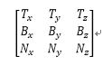
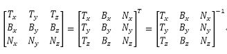

## 记录 [Shader book](https://thebookofshaders.com/?lan=ch) 的学习笔记  

+ 用算法绘画
+ 网格噪声
+ 分形布朗运动  

******

## UnityShader内置函数  

+ **ComputeScreenPos**  
    看该函数的命名第一直觉是该函数返回的是屏幕空间下的坐标值，但是该函数返回的是齐次坐标下的屏幕坐标值  
    *ComputeScreenPos*返回的值是齐次坐标系下的屏幕坐标值，其范围为[0, w]。那么为什么Unity要这么做呢？Unity的本意是希望你把该坐标值用作tex2Dproj指令的参数值，tex2Dproj会在对纹理采样前除以w分量。
    [Unity Shader中的ComputeScreenPos函数](https://www.jianshu.com/p/df878a386bec)  

>
+ **_ScreenParams**
    屏幕参数：x = 屏幕宽度，y = 屏幕高度，z =  1 + 1.0/屏幕宽度, w = 1 + 1.0/height屏幕高度(指像素数)

******

## 切线空间  
  
   

T、B、N都是在本地坐标系下的值，因此这个列向量构成的 [T B N] 矩阵，**是将点从切线坐标系变换到本地坐标系的变换矩阵**。 那么这个矩阵的逆矩阵，就是将点从本地坐标系变换到切线坐标系的变换矩阵。而由于正交，其逆矩阵就是其转置矩阵，所以从本地坐标系变换到切线坐标系的变换矩阵，就是我们在第2小节里面看到的情况。 
 
[Unity 中的坐标系](https://blog.csdn.net/ronintao/article/details/52136673)