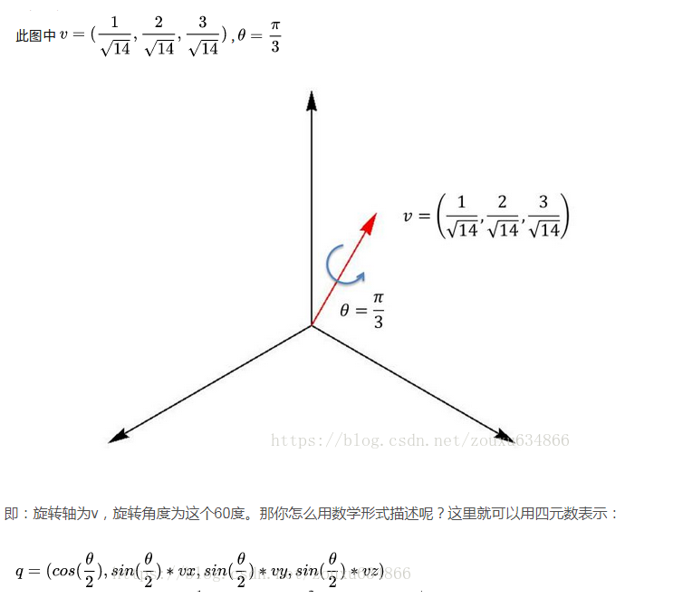

# 万向锁问题  

[万向锁视频](http://vo.youku.com/v_show/id_XNzkyOTIyMTI=.html)  

旋转顺序会导致万向锁问题。  

**怎么避免万向锁问题**
+ 规定选择顺序尽最大可能避免 万向锁，y>x>z
+ 用**四元素**
+ 用矩阵旋转  

******

## 四元素  

一个四元数包含一个标量分量和一个3D向量分量。经常记标量分量为w，记向量分量为单一的v或分开的x，y，z。两种记法分别如下：
+ [w,v]
+ [w,(x,y,z)]

这里 $v$ 代表旋转轴的向量
$w$ 代表旋转角度

[3D数学读书笔记——四元数](https://blog.csdn.net/zhurui_idea/article/details/25400659)
[四元数（转自知乎）](https://www.cnblogs.com/hjlweilong/p/6018746.html)  

******